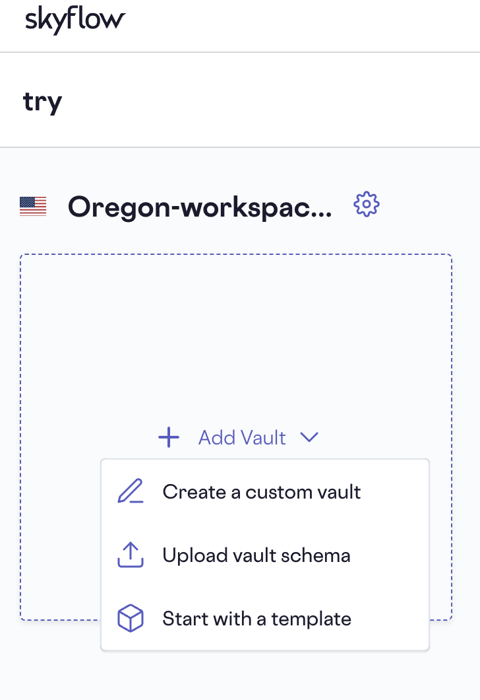
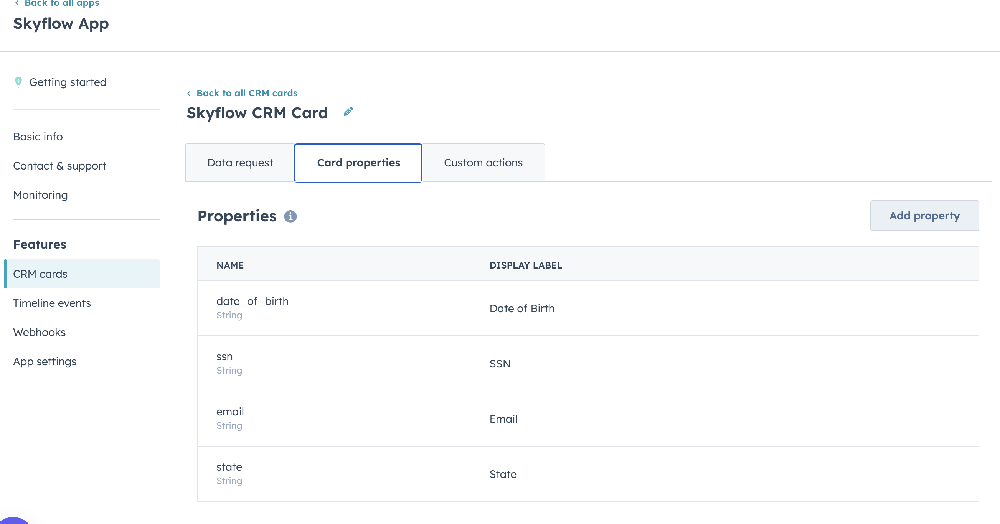
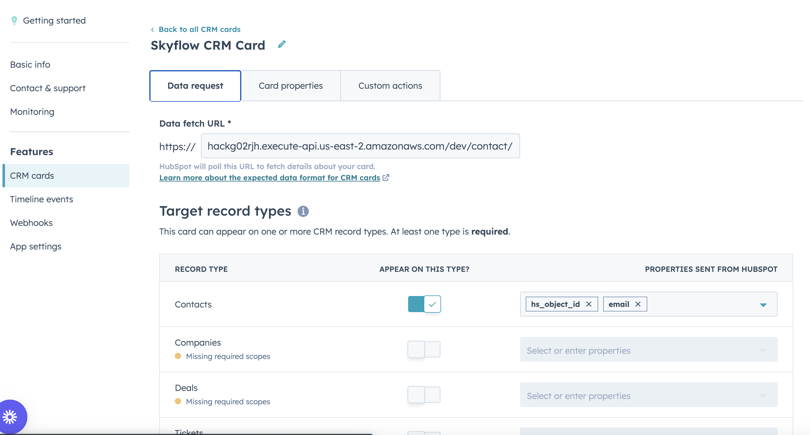

### The project is a simple demo for the Hubspot Skyflow integration. 

## The Challenge of HIPAA Compliance in HubSpot
Under HIPAA, businesses in the healthcare industry must adhere to strict regulations when handling PHI. However, HubSpot doesn’t offer native HIPAA compliance, posing a significant challenge for companies that need to collect and manage regulated data within the platform. Storing PHI in HubSpot can lead to potential compliance violations and security risks.

While there are alternative methods to address HIPAA compliance in HubSpot, they often fall short in terms of secure, efficient, and effective use of sensitive data. Some companies resort to manual data redaction or encryption, which can be time-consuming and error-prone. Others may choose to use separate systems for managing regulated data, leading to data silos and fragmented workflows. These approaches break existing workflows and lack the comprehensive security and streamlined integration necessary for effective HIPAA compliance.

## Skyflow’s Solution for HIPAA Compliance in HubSpot
Skyflow is a data privacy vault that isolates, protects, and governs sensitive customer data like PHI. It acts as a protective layer, ensuring that only authorized systems and users have access to the actual sensitive data. Instead of storing the sensitive data directly within HubSpot, the vault transforms it securely into non-exploitable de-identified references to the original data.

Skyflow offers a solution for businesses seeking HIPAA compliance in HubSpot. By integrating Skyflow with HubSpot, companies can securely collect and manage regulated data while keeping their HubSpot account out of scope. Skyflow can also help HubSpot customers address other regulations like data residency requirements, GDPR, CCPA, DPDP, and many more.

More details in this [blog](https://www.skyflow.com/post/hipaa-compliance-in-hubspot-crm)

## Steps to follow

### Create a Vault

Start here to [create a Vault](https://docs.skyflow.com/get-started/)
For the demo, we will use a predefined Vault and it can be created from an existing schema. 

The schema is available in ```vault-schema``` folder



### Create a service account

Follow the instructions here to [create a service account with API keys](https://docs.skyflow.com/api-authentication/#enable-api-key-based-authentication)

### Inserting data into the Vault

Follow the instructions here to [insert data](https://docs.skyflow.com/insert-records/)

Or use the script below
```bash
curl --location 'https://ebfc9bee4242.vault.skyflowapis.com/v1/vaults/<vualt-id>/persons' \
--header 'Content-Type: application/json' \
--header 'Accept: application/json' \
--header 'X-SKYFLOW-ACCOUNT-ID: <account-id>' \
--header 'Authorization: Bearer <API Key here>' \
--data-raw '{
    "quorum": false,
    "records": [
        {
            "fields": {
                "date_of_birth": "1990-07-21",
                "email_address": "email@someemail.com",
                "name": "Thomas Zach",
                "ssn": "123-21-1234",
                "state": "FL"
            }
        }
    ],
    "tokenization": false
}'
```
### Deploy the lamda
Follow instructions in the folder ```hubspot-lamda-sam``` to deploy the AWS lambda app

### Create the HubSpot App and map properties



Also map the fetch url and configure email to be passed as a property. The email is used to query the record fom the Vault



### Authorize CRM App
